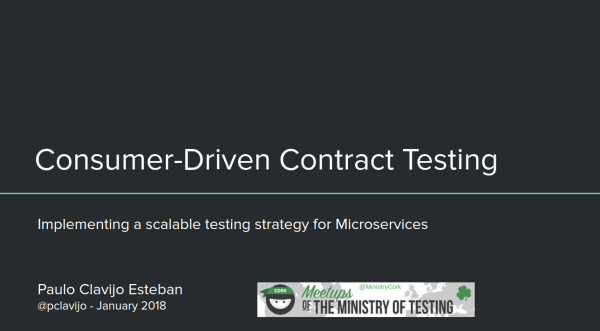

# task_list_api-kotlin-pact

A sample micro-service that demonstrates how Pact Contract tests work on the Provider Side. Implemented in Kotlin + 
Spring Boot.
The provider contract tests run with the 
[pact-jvm-provider-spring](https://github.com/DiUS/pact-jvm/tree/master/pact-jvm-provider-spring) RestPactRunner 
exercising only the API Controller code.

This demo was used during my 
talk [Consumer-Driven Contract Testing – Implementing a scalable testing strategy for Microservices](https://www.slideshare.net/paucls/consumerdriven-contract-testing).

